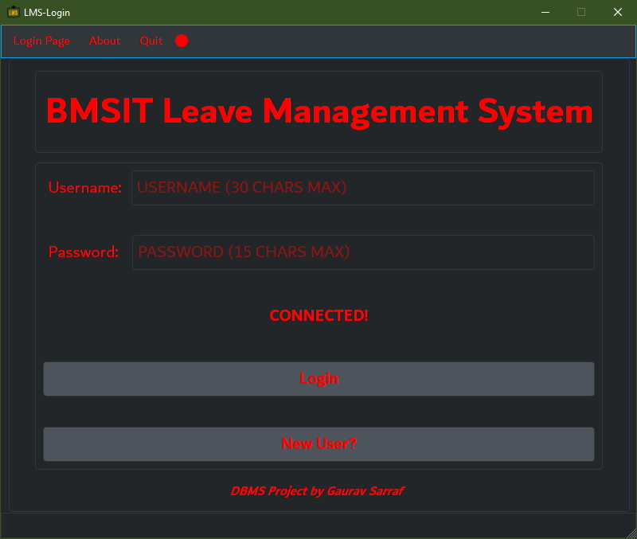
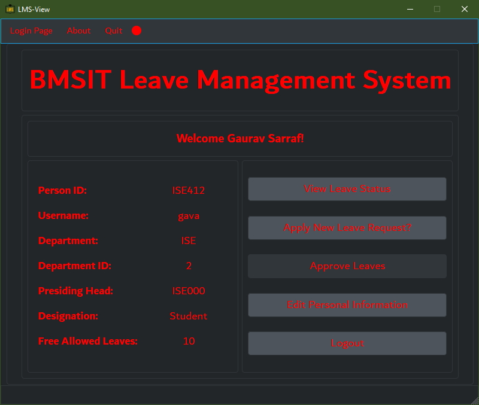
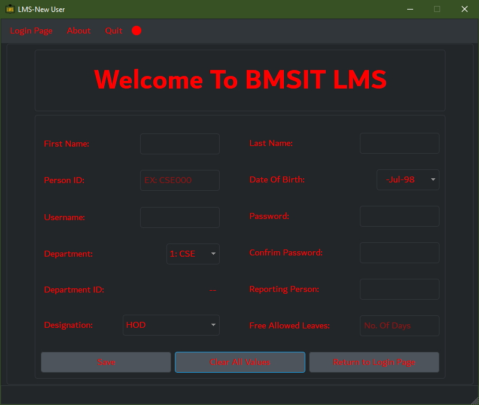

# Database-Management-System-Project
## Leave Management System for Educational Institute.

Database Management System Project prescribed by Visveswaraiah Technological University for V Semester CSE/ISE.
Simple Leave Management System for educational institute following the chain of command in a professional college. 
Showcases the use of databases, especially cloud database (Google Cloud SQL used). Code good enough to be deployed on any Operating System.

Contact for executables. 

## Built Using:

* [Python 3.5](https://www.python.org/downloads/release/python-350/)
* [PyQt5](https://pypi.org/project/PyQt5/)
* [QtCreator](https://www.qt.io/qt-features-libraries-apis-tools-and-ide/)
* [QtDesigner](https://www.qt.io/)
* [QDarkStyle](https://pypi.org/project/QDarkStyle/)
* [MySQL 8.0 Workbench](https://www.mysql.com)
* [Google Cloud SQL](https://cloud.google.com/)

## Bugs:

The pop up boxes open up again after accepting an input. Testing has revealed it shows up at least 3 times.
The bug lies in PyQt5 QMessageBox api.

Fix will be posted as soon as I fix it. Public fixes are welcome as well. :)

## How to execute:

Make sure you clone the whole repository for the iamages to work. Make sure [LMS_FULL_CONTROLLER.py](LMS_FULL_CONTROLLER.py) and [LMS_FULL_UI.py](LMS_FULL_UI.py) are in the same folder.

Then enter this in your Command Prompt or Terminal: 
`py ../LMS_FULL_CONTOLLER.py`

## Snapshots:

